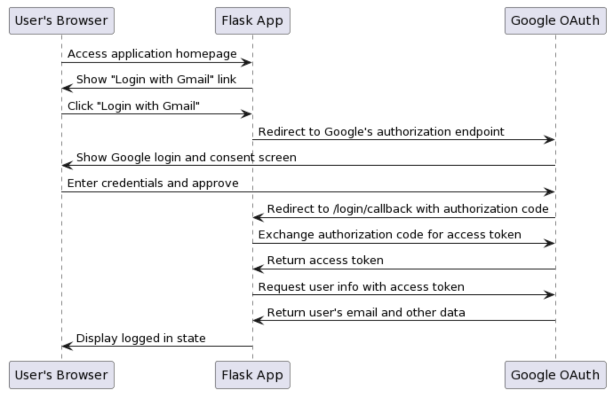

# python-flask-oauth

App is Flask Google OAuth App

This Flask application demonstrates the OAuth2.0 authentication flow using Google as the OAuth provider.



## Setup

1. Make sure you have Python and `pip` installed.

2. Install the necessary Python packages:
   ```bash
   pip install -r requirements.txt
    ```

3. Go to the Google Cloud Console and Create a new project / choose existing project. Navigate to the "OAuth consent screen" and configure the consent screen.

Go to "Credentials", click on "Create Credentials" and choose "OAuth 2.0 Client IDs".
Choose "Web application" as the application type.
Provide a name and under "Authorized redirect URIs", add http://localhost:5000/login/callback. Adjust the URI as needed.
Save. You'll get a client ID and client secret. Note them down.